# Distributed computation with Mule 4 and kubernetes

In this example we are going to build and deploy into kubernetes:

- A simple **Quiz REST Api Mule application** as a micro-service.
- A **Worker Mule application** as a micro-service for **distributed data processing**.
- An **Apache Ignite cluster** for **distributed database and messaging**.
- A **Spring boot Admin server** to monitor our Spring Boot Applications.

## Table of Contents

  * [Getting Started](#getting-started)
    + [Overview](#overview)
    + [Prerequisites](#prerequisites)
        + [Preparing environment](#preparing-environment)
        + [Required system resources](#required-system-resources)
    + [kunernetes deployment, putting all together](#kunernetes-deployment-putting-all-together)
    + [Monitoring instances](#monitoring-instances)
    + [Testing this example](#testing-this-example)
        + [Data flow summary](#data-flow-summary)
        + [Playing with kubernetes scaling](#playing-with-kubernetes-scaling)
  * [Appendix](#appendix)
    + [Full clean-up this sample from your computer](#clean-up)
  * [License](#license)

## Getting Started

### Overview
The goal of this example is show how to **join Mule's productivity** with the **Spring Boot ecosystem** 
using the [Spring boot starter for Mule 4](https://github.com/hawkore/mule4-spring-boot-starter), 
gain **high avaliability** deploying **Mule Applications** as micro-services into kubernetes and perform **distributed data processing** 
using the [Apache Ignite Connector for Mule 4](https://www.hawkore.com/plugins/product/pl-g-big-data/pl-t-ignite/pl-p-ignitev4). 

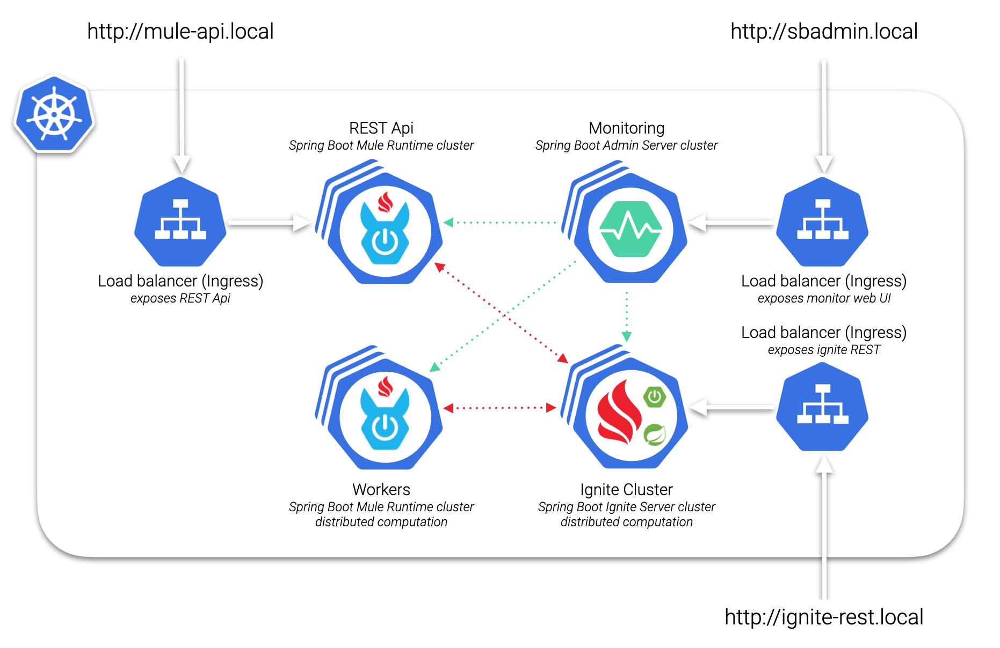

[Learn more about Mule ESB.](https://blog.hawkore.com/2020/04/02/mule-intro/)

[Learn more about Apache Ignite.](https://blog.hawkore.com/2020/03/27/apache-ignite-intro/)

### Prerequisites
 - A local [kubernetes development environment](https://blog.hawkore.com/2020/03/25/development-microk8s/)
     - JDK 8+
     - Maven 3.5.2+
     - Git
     - [Docker Desktop](https://www.docker.com/products/docker-desktop), with enabled Kubernetes
     - Kubernetes ingress
     - Kubernetes dashboard (optional)
 - Optionally, [Anypoint Studio 7](https://www.mulesoft.com/lp/dl/studio) to work with Mule Applications.

#### Preparing environment 

Before start deploying, you need to follow below steps:
- Create this directory on the root of your file system to store Apache Ignite Data: `/opt/k8s/ignite-work` (on windows `c:\opt\k8s\ignite-work`)
- Create this directory on the root of your file system to share some host artifacts: `/opt/k8s/shared` (on windows `c:\opt\k8s\shared`)
- Add aliases to localhost for kubernetes ingresses virtual hosts. Edit the `hosts` file on your machine and add the aliases `mule-api.local`, `sbadmin.local` and `ignite-rest.local` to the localhost's IP:
    ```
    127.0.0.1 localhost mule-api.local sbadmin.local ignite-rest.local
    ```
    - _`/etc/hosts` on linux/mac_
    - _`c:\windows\system32\drivers\etc\hosts` on windows_
    
#### Required system resources

- Ensure kubernetes has enough system resources to run this example:

    **Required resources**:
    - At least 6 GB free RAM space on reserved memory for kubernetes.
    - At least 4 GB free DISK space on local file system.
            
    Run `kubectl describe nodes` to ensure you have enough available resources:
    
    ``` bash
    ...
    Allocated resources:
      (Total limits may be over 100 percent, i.e., overcommitted.)
      Resource           Requests    Limits
      --------           --------    ------
      cpu                750m (9%)   0 (0%)
      memory             140Mi (2%)  340Mi (7%)
      ephemeral-storage  0 (0%)      0 (0%)
    Events:              <none>
    ```
 
    Increase assigned Memory whether necessary, open Docker Desktop Preferences -> Resources -> Advanced:
    
    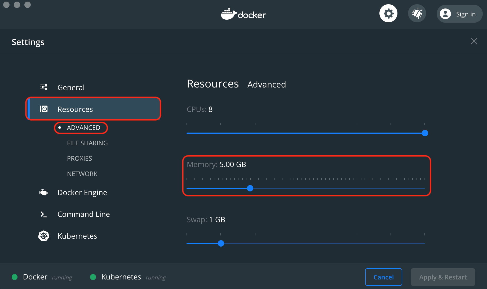

- Allow Docker Desktop access to local file system, open Docker Desktop Preferences -> Resources -> File sharing:

    **NOTE:** _On Docker Desktop for Windows select unit **C**_
    
    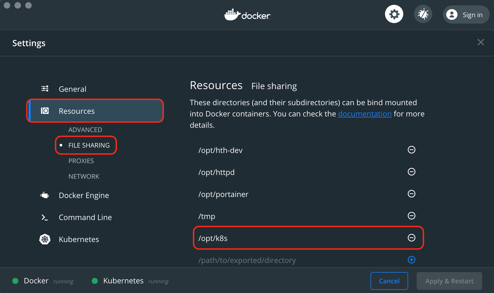

### kunernetes deployment, putting all together

Let's start building required artifacts.

1. Clone this project:
```
git clone https://github.com/hawkore/examples-spring-boot-mule4-kubernetes.git
cd examples-spring-boot-mule4-kubernetes
```

2. Ensure Docker and Kubernetes are started and ready.

3. Build required artifacts at once (Mule Applications and docker images):
    ``` bash
    mvn clean install -Pdocker
    ```
4. Copy packaged Mule applications into `shared` folder:
    - `test-mule-api/target/test-mule-api-1.0.0-mule-application.jar` into `/opt/k8s/shared` directory  (on windows `c:\opt\k8s\shared`).
    - `test-mule-worker/target/test-mule-worker-1.0.0-mule-application.jar` into `/opt/k8s/shared` directory (on windows `c:\opt\k8s\shared`).


Let's go with deployment into kubernetes. Please, follow below steps in order _within `examples-spring-boot-mule4-kubernetes` directory_:

1. Create [mandatory kubernetes artifacts](kubernetes/1-mandatory.yaml)
    ```
    kubectl apply -f kubernetes/1-mandatory.yaml
    ```

2. Create persistent volumes for your Operanting System:
    - For **Linux/Mac**: Apply this [persistent volumes descriptor](kubernetes/2-local-disk-volumes-linux-mac.yaml)
    
        **NOTE:** _Requires that `/opt/k8s/ignite-work` and `/opt/k8s/shared` directories exist_
        
        ```
        kubectl apply -f kubernetes/2-local-disk-volumes-linux-mac.yaml
        ```
    - For **Windows**: Apply this [persistent volumes descriptor](kubernetes/2-local-disk-volumes-windows.yaml):
    
        **NOTE:** _Requires that `c:\opt\k8s\ignite-work` and `c:\opt\k8s\shared` directories exist_
        
        ```
        kubectl apply -f kubernetes/2-local-disk-volumes-windows.yaml
        ```

3. Deploy [Spring Boot Admin Server](kubernetes/3-statefulset-sb-admin-server.yaml) into kubernetes (2 replicas):
    ```
    kubectl apply -f kubernetes/3-statefulset-sb-admin-server.yaml
    ```

4. Deploy [Spring Boot Ignite Server](kubernetes/4-statefulset-ignite-server-node.yaml) into kubernetes (1 replica):
    ```
    kubectl apply -f kubernetes/4-statefulset-ignite-server-node.yaml
    ```

5. Once Spring Boot Ignite Server is running, [install and activate a license for Apache Ignite Connector for Mule 4](kubernetes/5-INSTALL_AND_ACTIVATE_LICENSE.md)

6. Deploy [Worker Mule Application](kubernetes/6-statefulset-mule-worker-app.yaml) into kubernetes (2 replicas):
    ```
    kubectl apply -f kubernetes/6-statefulset-mule-worker-app.yaml
    ```

7. Deploy [Quiz REST Api Mule Application](kubernetes/7-statefulset-mule-api-app.yaml) into kubernetes (1 replica):
    ```
    kubectl apply -f kubernetes/7-statefulset-mule-api-app.yaml
    ```

### Monitoring instances

Open your browser and play with [Spring Boot Admin Server](http://sbadmin.local):

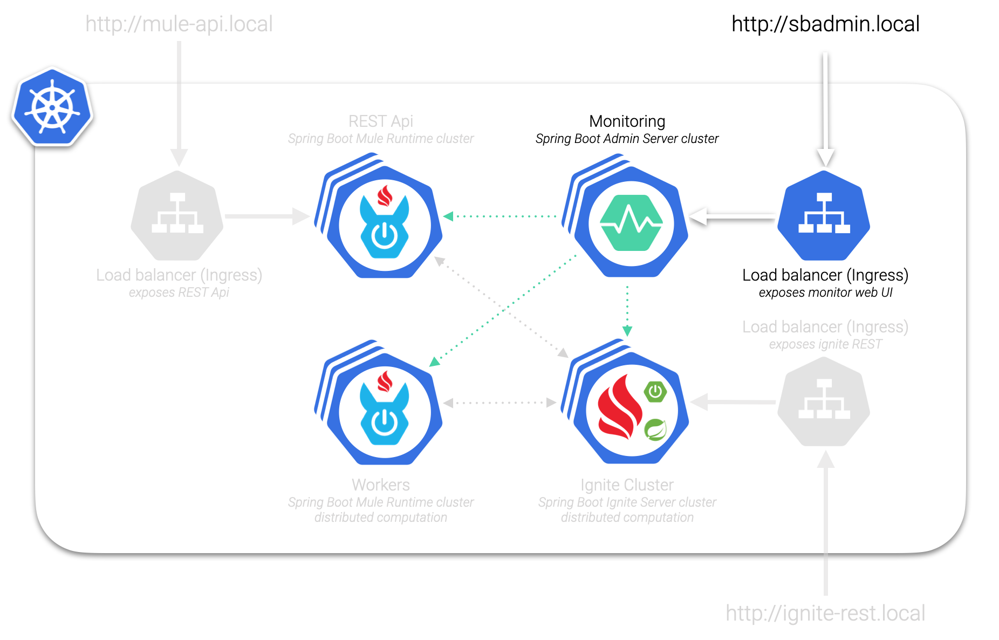

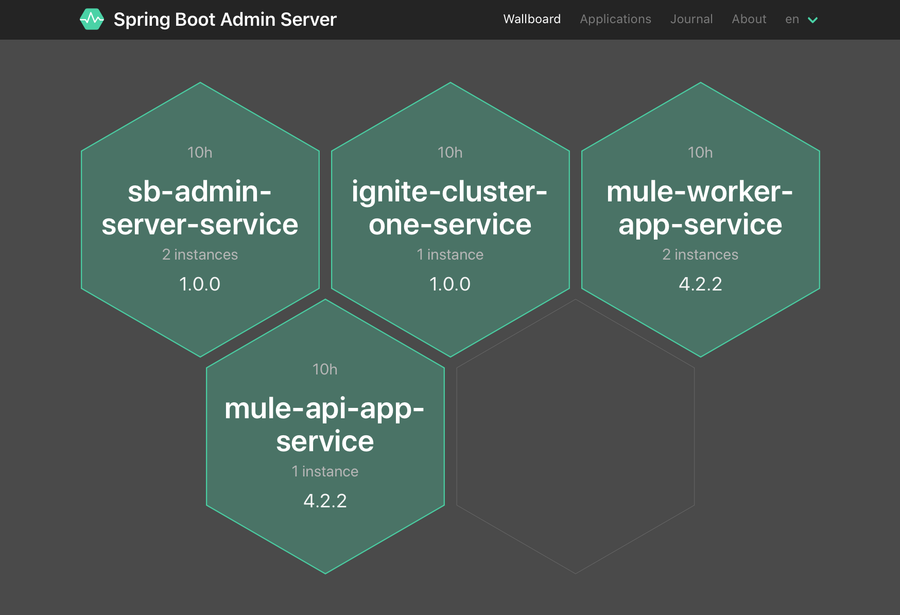

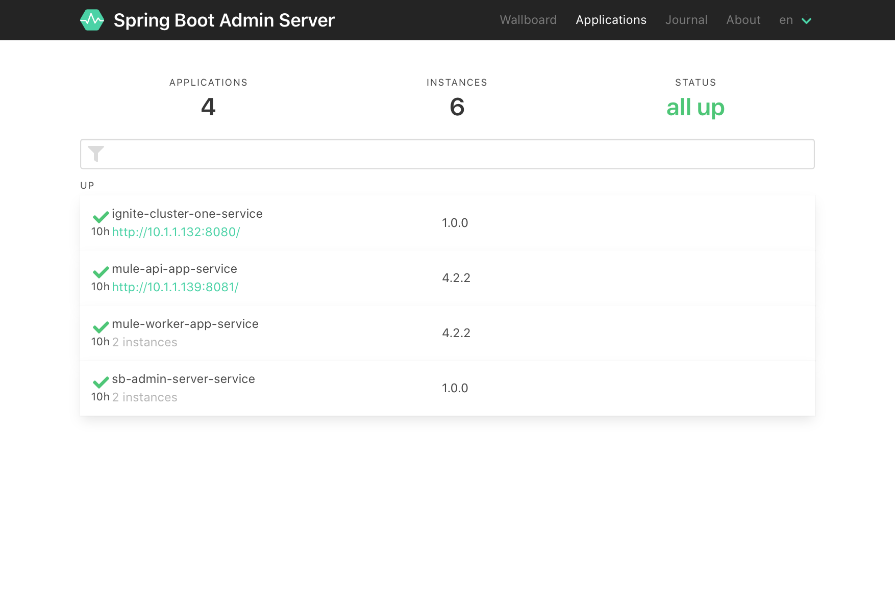


### Testing this example

Open your browser and play with [Quiz REST Api console](http://mule-api.local/console):


#### Data flow summary

- User's requests are balanced by internal kubernetes load balancer between our Quiz Api nodes. 

- Every received Quiz Response (POST request) by our Quiz API will be enqueued into an Apache Ignite Queue to perform **distributed data processing** by Workers.

    

    Mule flow to acquire Quizs from HTTP POST request and publish them to that distributed Queue:
   
    

- Workers will listen on that distributed Queue for new Quiz Responses to process:
    - Avoid more than one Quiz response per surveyed (distributed LOCK scope).
    - Update Quiz Responses with additional data.
    - Store Quiz Responses into Apache Ignite's **distributed database** (SQL Query Entity).
    - Update global stats.

    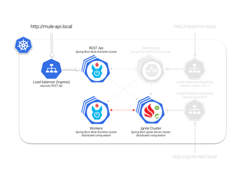

    Mule flow to listen on distributed Queue for new Quiz Responses to process, ensuring uniqueness:
   
    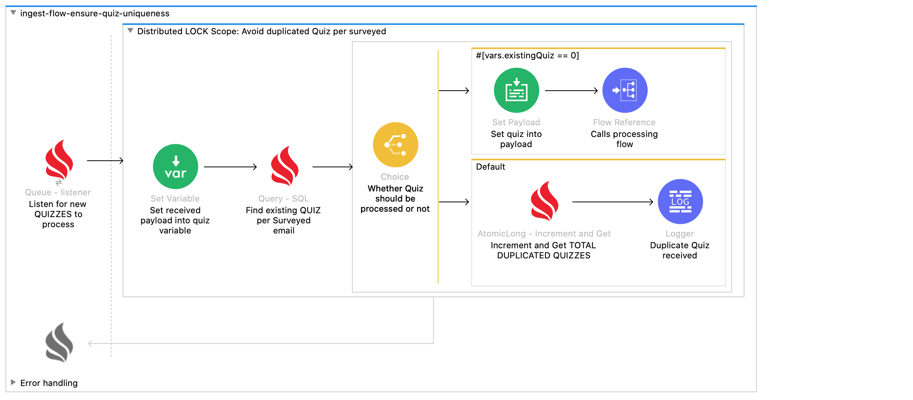

    Mule flow to process Quiz responses:
   
    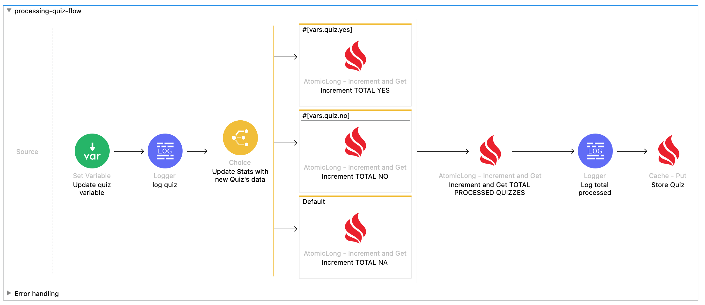

#### Playing with kubernetes scaling

1. Scale `mule-worker-app` to `1` replica and see what happens on [Spring Boot Admin Server Wallboard](http://sbadmin.local/wallboard):
    ```
    kubectl scale -n my-mule4-stack statefulset mule-worker-app --replicas=1
    ```

2. Stop all Workers (scale to `0`) and see what happens when create new Quiz Responses (POST request) and GET stats from [Quiz REST Api console](http://mule-api.local/console)

    _`totalReceived` should be increassed on every new received Quiz Response (POST request); `totalProcessed` and `totalDuplicated` should remain un-altered_
    
    ```
    kubectl scale -n my-mule4-stack statefulset mule-worker-app --replicas=0
    ```

    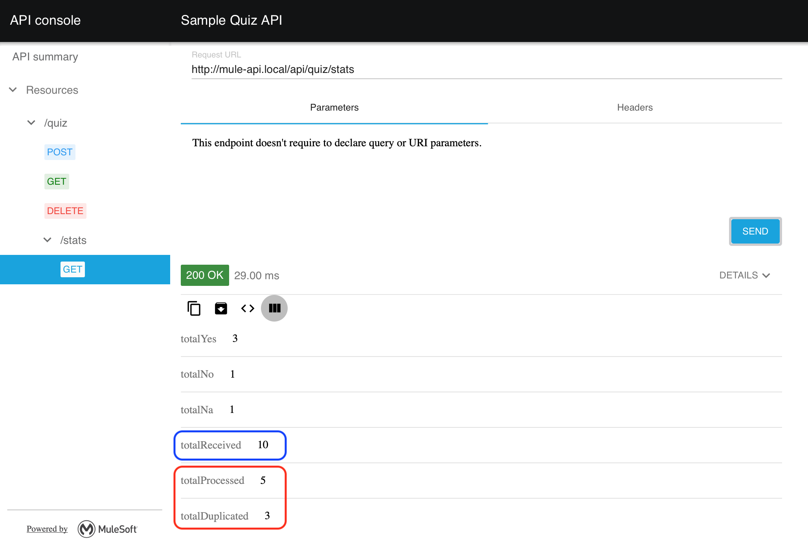

3. Scale `mule-worker-app` to `2` replicas and see what happens when GET stats from [Quiz REST Api console](http://mule-api.local/console)

    _Once Workers finish processing enqueued Quiz Responses, `totalProcessed` + `totalDuplicated` should be equals to `totalReceived`_
    
   ```
    kubectl scale -n my-mule4-stack statefulset mule-worker-app --replicas=2
    ```
    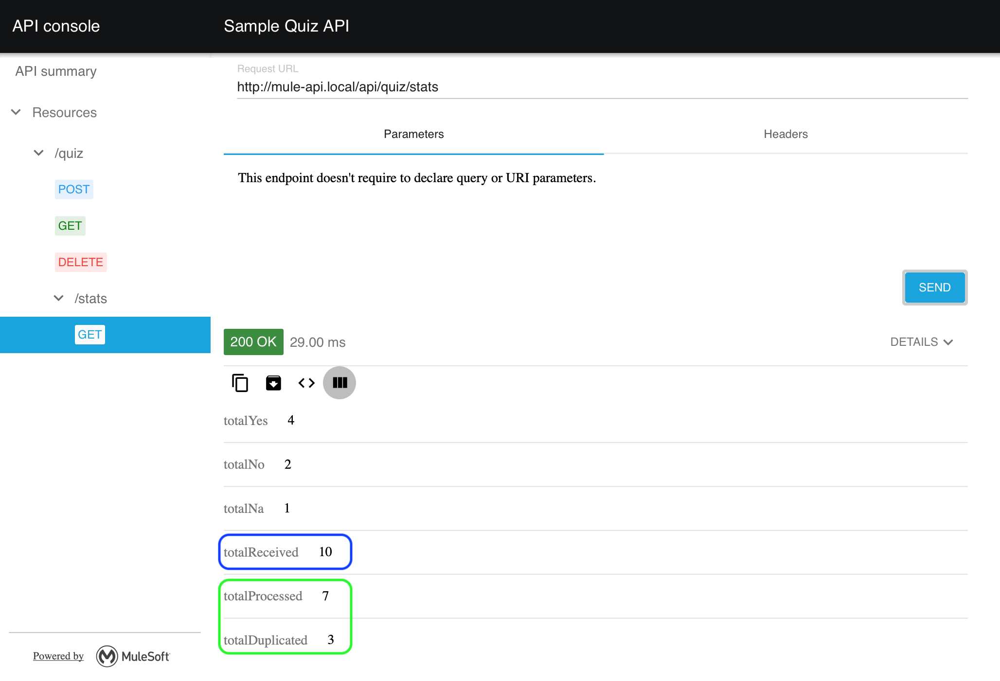


4. List Quiz Responses to see data enrichment and how Quiz processing was distributed between nodes:
    
    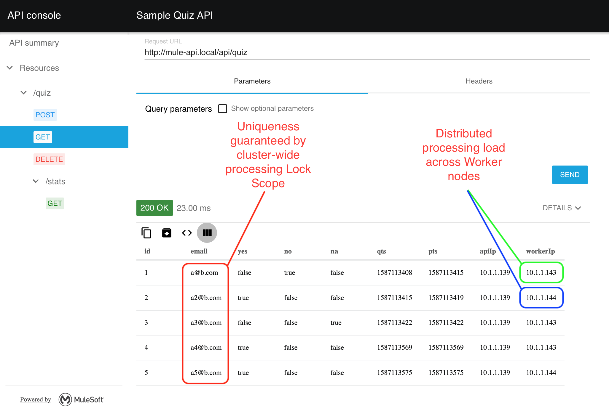
     
    - Quiz response information:
        - `id`: Response identifier.
        - `email`: Surveyed's email.
        - `yes`: a YES response.
        - `no`: a NO response.
        - `na`: a Non Answered Quiz.
        - `qts`: The timestamp when a Quiz was received by an Api Node.
        - `pts`: The timestamp when a Quiz was processed by a Worker node.
        - `apiIp`: the Api Node IP that received the Quiz. 
        - `workerIp`: the Worker Node IP that processed the Quiz. 

## Appendix

### Clean-up

To full clean-up this sample from your computer, follow below steps:

1. Remove namespace from kubernetes:
    ```
    kubectl delete namespace my-mule4-stack
    ```
2. Remove persistent volumes:
    ```
    kubectl delete persistentvolume ignite-storage
    kubectl delete persistentvolume shared-storage
    ```
3. Optionally, delete `/opt/k8s` directory. **WARNING**: If you delete `/opt/k8s` directory you will lose license activation for Apache Ignite Connector!!

## License
Copyright 2020 HAWKORE, S.L.

Licensed under the Apache License, Version 2.0 (the "License");
you may not use this file except in compliance with the License.
You may obtain a copy of the License at

http://www.apache.org/licenses/LICENSE-2.0

Unless required by applicable law or agreed to in writing, software
distributed under the License is distributed on an "AS IS" BASIS,
WITHOUT WARRANTIES OR CONDITIONS OF ANY KIND, either express or implied.
See the License for the specific language governing permissions and
limitations under the License.


## About subcomponents
This project may contains subcomponents with separate copyright
notices and license terms. Your use of the source code for the these
subcomponents is subject to the terms and conditions of them.
