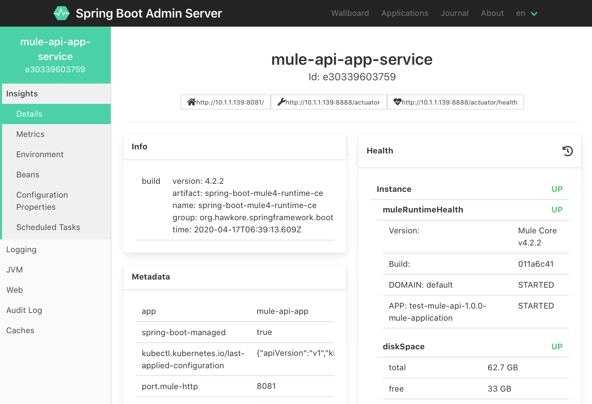

# Distributed computation with Mule 4 and Kubernetes

In this example, we are going to create a system to collect quizzes. 
We'll deploy it as a set of clustered micro-services on Kubernetes to ensure **high availability**, 
we'll use Apache Ignite to support **distributed computation**, 
and **manage** the entire spring-boot system with Spring Boot Admin Server.

## Table of Contents

  * [Getting Started](#getting-started)
    + [Overview](#overview)
        + [Architecture](#architecture)
        + [Data acquisition phase](#data-acquisition-phase)
        + [Data processing phase](#data-processing-phase)
    + [Prerequisites](#prerequisites)
        + [Preparing the environment](#preparing-the-environment)
        + [Required system resources](#required-system-resources)
    + [Kubernetes deployment, putting it all together](#kubernetes-deployment-putting-it-all-together)
    + [Monitoring instances](#monitoring-instances)
    + [Testing this example](#testing-this-example)
        + [Play with Kubernetes scaling](#play-with-kubernetes-scaling)
  * [Appendix](#appendix)
    + [Test your own modifications](#test-your-own-modifications)
    + [Full clean-up this sample from your computer](#clean-up)
    + [Learn more](#learn-more)
  * [License](#license)

## Getting Started

### Overview
The goal of this example is to show you how to join **Mule's productivity** with the **Spring Boot ecosystem** 
using the [Spring Boot Starter for Mule 4](https://github.com/hawkore/mule4-spring-boot-starter). 
Gain **high availability** deploying **Mule Applications** as clustered micro-services on Kubernetes and perform **distributed data processing** 
using the [Apache Ignite Connector for Mule 4](https://blog.hawkore.com/2020/04/27/apache-ignite-connector-mule-starting/). 

#### Architecture
Our system to collect quizzes is composed of: 
- A **[REST Api](mule-api-app/README.md)**: It's a Mule application deployed as a clustered micro-service (_**[data acquisition phase](#data-acquisition-phase)**_ and other operations like **queries over distributed database**).
- A **[Worker](mule-worker-app/README.md)**: It's a Mule application deployed as a clustered micro-service for **distributed data processing** (_**[data processing phase](#data-processing-phase)**_).
- An **[Apache Ignite Server](spring-boot-apache-ignite-server/README.md)** cluster with persistence enabled for **distributed data storage** and **distributed computation**.
- A **[Spring Boot Admin Server](spring-boot-admin-server/README.md)** cluster to monitor our Spring Boot applications.


#### Data acquisition phase

1. User's requests are balanced by internal Kubernetes load balancer between our REST Api nodes to ensure high availability.

2. Every received Quiz (POST request) by our REST API will be enqueued into an Apache Ignite Queue to perform **distributed data processing** by Workers.


#### Data processing phase

Workers will listen on a distributed Queue for new Quizzes to process:
- Avoiding more than one Quiz per surveyed (**distributed LOCK scope**).
- Updating Quizzes with additional data.
- Storing Quizzes into Apache Ignite's **distributed database** (SQL Query Entity).
- Updating global stats.


### Prerequisites
 - A local [kubernetes development environment](https://blog.hawkore.com/2020/03/25/development-microk8s/)
     - JDK 8+
     - Maven 3.5.2+
     - Git
     - [Docker Desktop](https://www.docker.com/products/docker-desktop), with enabled Kubernetes
     - Kubernetes ingress
     - Kubernetes dashboard (optional)
 - Optionally, [Anypoint Studio 7](https://www.mulesoft.com/lp/dl/studio) to work with Mule Applications.

#### Preparing the environment 

Before you start deploying, you need to observe the following steps:
- Create this directory on the root of your file system to store Apache Ignite Data: `/opt/k8s/ignite-work` (on windows `c:\opt\k8s\ignite-work`)
- Create this directory on the root of your file system to share some host artifacts: `/opt/k8s/shared` (on windows `c:\opt\k8s\shared`)
- Add aliases to localhost for Kubernetes ingresses virtual hosts. Edit the `hosts` file on your machine and add the aliases `mule-api.local`, `sbadmin.local` and `ignite-rest.local` to the localhost's IP:
    ```
    127.0.0.1 localhost mule-api.local sbadmin.local ignite-rest.local
    ```
    - _`/etc/hosts` on linux/mac_
    - _`c:\windows\system32\drivers\etc\hosts` on windows_
    
#### Required system resources

- Ensure Kubernetes has enough system resources to run this example:

    **Required resources**:
    - At least 6 GB free RAM space on reserved memory for Kubernetes.
    - At least 4 GB free DISK space on local file system.
            
    Run `kubectl describe nodes` to ensure you have enough available resources:
    
    ```bash
    ...
    Allocated resources:
      (Total limits may be over 100 percent, i.e., overcommitted.)
      Resource           Requests    Limits
      --------           --------    ------
      cpu                750m (9%)   0 (0%)
      memory             140Mi (2%)  340Mi (7%)
      ephemeral-storage  0 (0%)      0 (0%)
    Events:              <none>
    ```
 
    Increase assigned Memory if necessary, open Docker Desktop Preferences -> Resources -> Advanced:
    
    

- Allow Docker Desktop access to local file system, open Docker Desktop Preferences -> Resources -> File sharing:

    **NOTE:** _On Docker Desktop for Windows select unit **C**_
    
    

### Kubernetes deployment, putting it all together

Let's start by building the required artifacts.

1. Clone this project:
    ```bash
    git clone https://github.com/hawkore/examples-spring-boot-mule4-kubernetes.git
    cd examples-spring-boot-mule4-kubernetes
    ```
2. Ensure Docker and Kubernetes are started and ready.

3. Build the required artifacts at once (Mule Applications and Docker images):
    ```bash
    mvn clean install -Pdocker -Dmule.bom.version=4.2.2-hf5
    ```
4. Copy packaged Mule applications into `shared` folder:
    - `mule-api-app/target/mule-api-app-1.0.0-mule-application.jar` into `/opt/k8s/shared` directory  (on windows `c:\opt\k8s\shared`).
    - `mule-worker-app/target/mule-worker-app-1.0.0-mule-application.jar` into `/opt/k8s/shared` directory (on windows `c:\opt\k8s\shared`).


Follow by deploying on Kubernetes. Please, observe the following steps in order _within `examples-spring-boot-mule4-kubernetes` directory_:

1. Create [mandatory Kubernetes artifacts](kubernetes/1-mandatory.yaml)
    ```bash
    kubectl apply -f kubernetes/1-mandatory.yaml
    ```

2. Create persistent volumes for your Operating System:
    - For **Linux/Mac**: Apply this [k8s yaml file for persistent volumes on Linux/Mac](kubernetes/2-local-disk-volumes-linux-mac.yaml)
    
        **NOTE:** _Requires that `/opt/k8s/ignite-work` and `/opt/k8s/shared` directories exist_
        
        ```bash
        kubectl apply -f kubernetes/2-local-disk-volumes-linux-mac.yaml
        ```
    - For **Windows**: Apply this [k8s yaml file for persistent volumes on Windows](kubernetes/2-local-disk-volumes-windows.yaml):
    
        **NOTE:** _Requires that `c:\opt\k8s\ignite-work` and `c:\opt\k8s\shared` directories exist_
        
        ```bash
        kubectl apply -f kubernetes/2-local-disk-volumes-windows.yaml
        ```

3. Deploy [Spring Boot Admin Server](spring-boot-admin-server/README.md) on Kubernetes (2 replicas):
    ```bash
    kubectl apply -f kubernetes/3-statefulset-sb-admin-server.yaml
    ```

4. Deploy [Spring Boot Ignite Server](spring-boot-apache-ignite-server/README.md) on Kubernetes (1 replica):
    ```bash
    kubectl apply -f kubernetes/4-statefulset-ignite-server-node.yaml
    ```

5. Once Spring Boot Ignite Server is running, [install and activate a license for Apache Ignite Connector for Mule 4](kubernetes/5-INSTALL_AND_ACTIVATE_LICENSE.md)

6. Deploy [Quiz REST Api - Mule Application](mule-api-app/README.md) on Kubernetes (1 replica):
    ```bash
    kubectl apply -f kubernetes/6-statefulset-mule-api-app.yaml
    ```

7. Deploy [Worker - Mule Application](mule-worker-app/README.md) on Kubernetes (2 replicas):
    ```bash
    kubectl apply -f kubernetes/7-statefulset-mule-worker-app.yaml
    ```

### Monitoring instances

Open your browser and play with [Spring Boot Admin Server](http://sbadmin.local):




### Testing this example

Open your browser and play with [Quiz REST Api console](http://mule-api.local/console):


#### Play with Kubernetes scaling

1. Scale `mule-worker-app` to `1` replica and see what happens on [Spring Boot Admin Server Wallboard](http://sbadmin.local/wallboard):
    ```bash
    kubectl scale -n my-mule4-stack statefulset mule-worker-app --replicas=1
    ```

2. Stop all Workers (scale to `0`) and see what happens when you create new Quizzes (POST request) and GET stats from [Quiz REST Api console](http://mule-api.local/console)

    _`totalReceived` should be increased on every new received Quiz (POST request); `totalProcessed` and `totalDuplicated` should remain un-altered_
    
    ```bash
    kubectl scale -n my-mule4-stack statefulset mule-worker-app --replicas=0
    ```

    

3. Scale `mule-worker-app` to `2` replicas and see what happens when GET stats from [Quiz REST Api console](http://mule-api.local/console)

    _Once Workers finish processing enqueued Quizzes, `totalProcessed` + `totalDuplicated` should be equals to `totalReceived`_
    
    ```bash
    kubectl scale -n my-mule4-stack statefulset mule-worker-app --replicas=2
    ```
    


4. List Quizzes to see how data processing was distributed between nodes:
    
    
     
    - Quiz's data:
        - `id`:  Unique identifier (`quizCache` key).
        - `email`: Surveyed email.
        - `yes`: a YES response.
        - `no`: a NO response.
        - `na`: a Non Answered Quiz.
        - `qts`: The timestamp when a Quiz was received by an Api Node.
        - `pts`: The timestamp when a Quiz was processed by a Worker node.
        - `apiIp`: the Api Node IP that received the Quiz. 
        - `workerIp`: the Worker Node IP that processed the Quiz. 

## Appendix

### Test your own modifications

If you want to modify `mule-api-app` or `mule-worker-app` and re-deploy them, follow these steps:

1. Package again and copy the generated jar file into `/opt/k8s/shared` directory, for example:
    ```bash
    cd mule-api-app
    mvn clean package
    cp target/mule-api-app-1.0.0-mule-application.jar /opt/k8s/shared/
    ```

2. Restart the Kubernetes statefulset of your modified Mule application, for example:
    ```bash
    kubectl rollout restart -n my-mule4-stack statefulset/mule-api-app
    ```

### Clean-up

To full clean-up this sample from your computer, follow these steps:

1. Remove namespace from Kubernetes:
    ```bash
    kubectl delete namespace my-mule4-stack
    ```
2. Remove persistent volumes:
    ```bash
    kubectl delete persistentvolume ignite-storage
    kubectl delete persistentvolume shared-storage
    ```
3. Optionally, delete `/opt/k8s` directory. **WARNING**: If you delete `/opt/k8s` directory you will lose the license activation for the Apache Ignite Connector!!

### Learn more
- About [Mule ESB](https://blog.hawkore.com/2020/04/02/mule-intro/).
- About [Apache Ignite](https://blog.hawkore.com/2020/03/27/apache-ignite-intro/).
- About [Spring Boot Starter for Mule 4](https://github.com/hawkore/mule4-spring-boot-starter).
- About [Spring Boot Admin Server](https://github.com/codecentric/spring-boot-admin#codecentrics-spring-boot-admin).

## License
Copyright 2020 [HAWKORE, S.L.](https://www.hawkore.com)

Licensed under the Apache License, Version 2.0 (the "License");
you may not use this file except in compliance with the License.
You may obtain a copy of the License at

http://www.apache.org/licenses/LICENSE-2.0

Unless required by applicable law or agreed to in writing, software
distributed under the License is distributed on an "AS IS" BASIS,
WITHOUT WARRANTIES OR CONDITIONS OF ANY KIND, either express or implied.
See the License for the specific language governing permissions and
limitations under the License.


## About subcomponents
This project may contain subcomponents with separate copyright
notices and license terms. Your use of the source code for these
subcomponents is subject to their terms and conditions.
