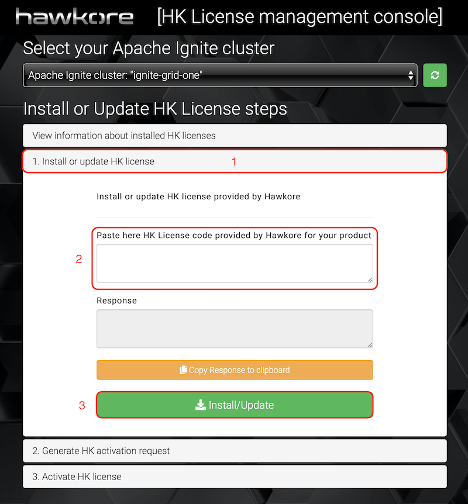
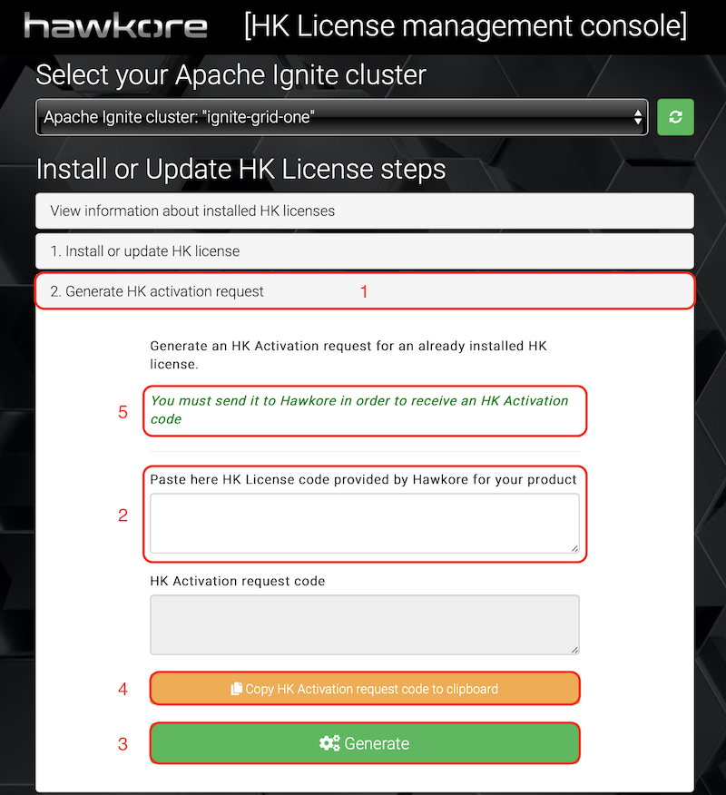
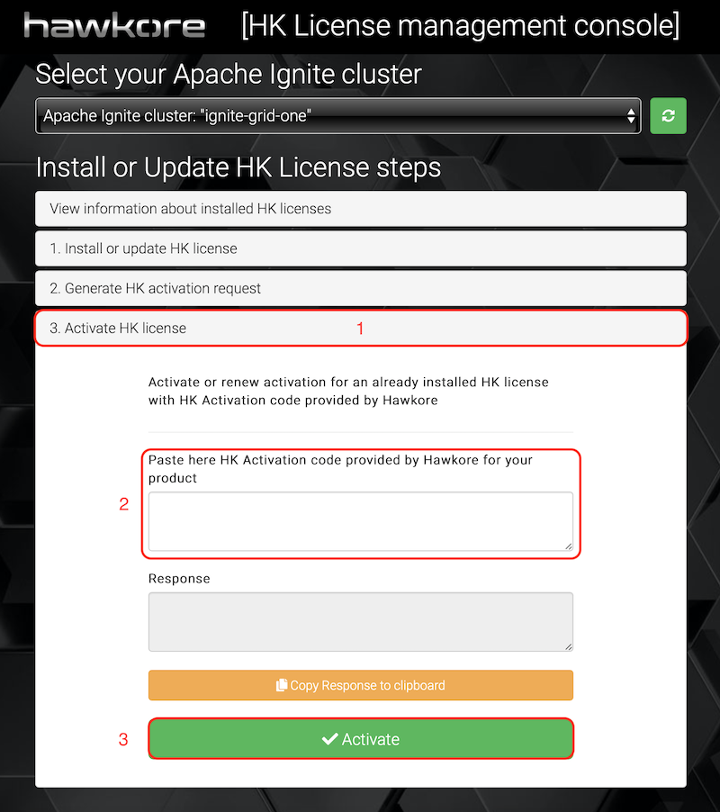

# Install license for Apache Ignite Connector
We are going to deploy Mule applications that use [Apache Ignite Connector for Mule 4](https://www.hawkore.com/plugins/product/pl-g-big-data/pl-t-ignite/pl-p-ignitev4) in a kubernetes cluster, so at this point you need to install a valid license prior to deploy sample Mule applications, if you haven't installed it yet.

Contact [Hawkore](https://www.hawkore.com/contact) to request a TRIAL license for Apache Ignite Connector for Mule4.

Ensure Spring Boot Apache Ignite Server is running, then open HK license manager in your browser [http://ignite-rest.local/hk-license/hk-license-ui.html](http://ignite-rest.local/hk-license/hk-license-ui.html) and follow steps to install and activate provided license.

1. You will receive the license by email. Install it into your Apache Ignite Cluster:

    
    
2. Generate an activation request and send it to Hawkore replying to received email on step 1:

   

3. You will receive the activation code by email. Activate license into your Apache Ignite Cluster:

   
