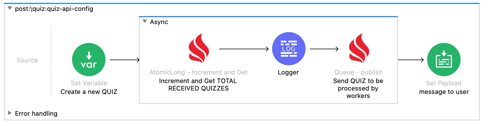
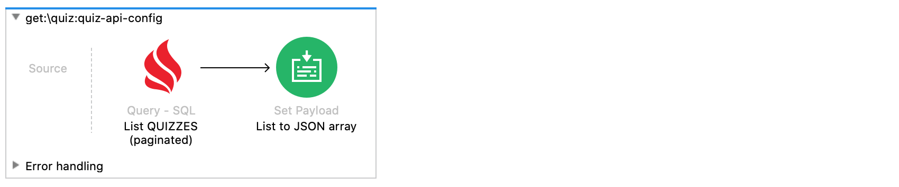
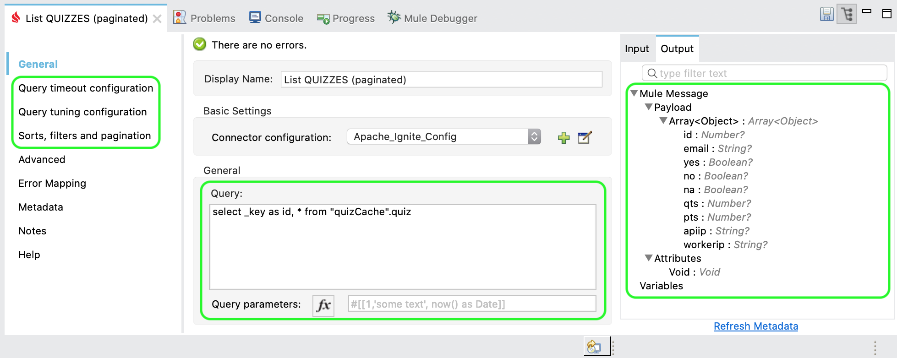

# Sample Quiz REST Api

This is our Quiz REST Api implementation using Mule's APIKit router and [RAML 1.0 definition](./src/main/resources/api/quiz.raml). 


## Model and distributed database
 
Quiz entity (_convenient annotated for SQL_). Take a look to `org.hawkore.samples.api.quiz.entities.Quiz` for more details:
- `id`: Unique identifier (`quizCache` key).
- `email`: Surveyed's email.
- `yes`: a YES response.
- `no`: a NO response.
- `na`: a Non Answered Quiz.
- `qts`: The timestamp when a Quiz was received by an Api Node.
- `pts`: The timestamp when a Quiz was processed by a Worker node.
- `apiIp`: the Api Node IP that received the Quiz. 
- `workerIp`: the Worker Node IP that processed the Quiz. 

Quizzes will be stored into an Apache Ignite distributed Cache (`quizCache`), so, to enable SQL over this cache
just [configure cache](src/main/resources/ignite-config.xml) to take care of this entity as an `SQL Query Entity`, 
just add tuple (`java.lang.Long`, `org.hawkore.samples.api.quiz.entities.Quiz`) into `indexedTypes` property - _array of tuples (key type , value type)_ -:

```xml
<bean name="quiz-cache" id="quiz-cache" class="org.apache.ignite.configuration.CacheConfiguration">
    <property name="name" value="quizCache" />
    <property name="cacheMode" value="PARTITIONED" />
    <property name="indexedTypes">
        <array>
            <value>java.lang.Long</value>
            <value>org.hawkore.samples.api.quiz.entities.Quiz</value>
        </array>
    </property>
</bean>
```
## Api operations:

Our REST Api implements below operations:

- Send a new Quiz (POST /api/quiz)
- List Quizzes (GET /api/quiz)
- Clear all quizzes and stats (DELETE /api/quiz)
- Retrieve global stats (GET /api/quiz/stats)

### Send a new Quiz (POST /api/quiz)

Every received Quiz (POST request) by our REST API will be enqueued into an Apache Ignite Queue to perform **distributed data processing** by Workers (see [mule-worker-app](../mule-worker-app/README.md)).


Mule flow to acquire Quizzes from HTTP POST request (/api/quiz) and publish them to a distributed Queue:



### List Quizzes

As simple as query distributed database (`quizCache`) using SQL:





### Clear all quizzes and stats

It will delete all data stored in distributed quiz's cache (`quizCache`) and reset all **distributed atomic Longs** to `0` (global stats).

### Retrieve global stats

Retrieve global stats (**distributed atomic Longs**) as JSON:
```json
{
	"totalYes": 0,
	"totalNo": 0,
	"totalNa": 0,
	"totalReceived": 0,
	"totalProcessed": 0,
	"totalDuplicated": 0
}
```

## Ignite Configuration for kubernetes

Configure IP finder on [ignite-config.xml](src/main/resources/ignite-config.xml) as `org.apache.ignite.spi.discovery.tcp.ipfinder.kubernetes.TcpDiscoveryKubernetesIpFinder` with the **kubernetes service name** to find server nodes and the **namespace**.

```xml
 <bean id="ignite-config" class="org.apache.ignite.configuration.IgniteConfiguration">
    ...

    <!-- Explicitly configure TCP discovery SPI -->
    <property name="discoverySpi">
      <bean class="org.apache.ignite.spi.discovery.tcp.TcpDiscoverySpi">
        <property name="ipFinder">
          <!--
          Enables Kubernetes IP finder and set namespace and service name (cluster) to find SERVER nodes.
          -->
          <bean class="org.apache.ignite.spi.discovery.tcp.ipfinder.kubernetes.TcpDiscoveryKubernetesIpFinder">
            <property name="shared" value="true" />
            <property name="namespace" value="my-mule4-stack" />
            <property name="serviceName" value="ignite-cluster-one-service" />
          </bean>
        </property>
      </bean>
    </property>

    ...
</bean>
```

## Kubernetes artifacts

- Namespace `my-mule4-stack`, service `ignite-cluster-one-service` and service `mule-api-app-service` for discovery, spring management and load balancing are defined in [k8s configuration yaml for mandatory artifacts](../kubernetes/1-mandatory.yaml)
- Will be started as a micro-service using [Spring Boot Mule 4 Runtime CE docker image](../spring-boot-mule4-runtime-ce/README.md), see  [statefulSet configuration yaml for REST Api](../kubernetes/6-statefulset-mule-api-app.yaml)

## Build Mule application

Build application:

```bash
mvn clean package
```
